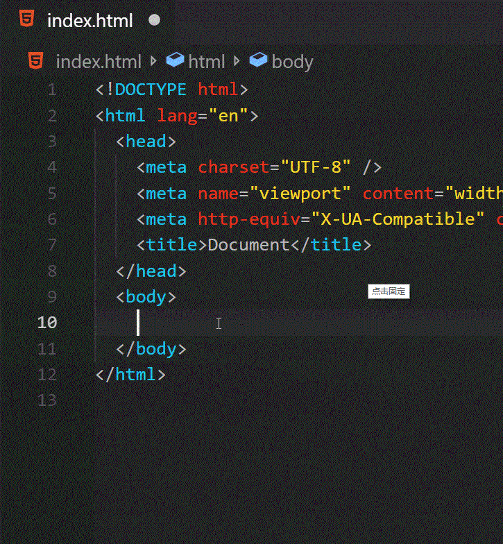
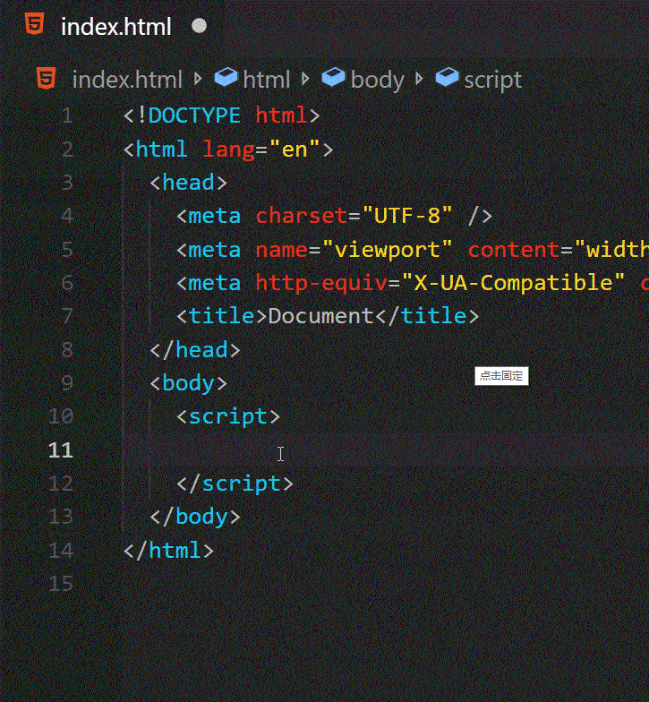
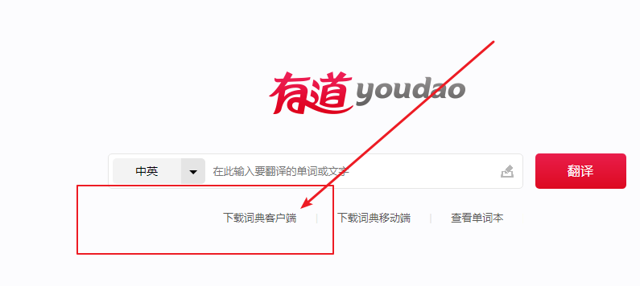
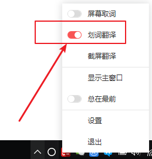

# 最强英语翻译技巧-IT人士专用

> 常规标题党...

## 英语渣渣--常规懵逼

------

## 想不想要这样的 看到就马上翻译

### 翻译普通的文字1

### 翻译普通的文字2

## 关键是图片中的文字也可以翻译！！

# 又怎么能少了代码中的翻译呢

# 再来体验

# 废话不多说，开始吧！

## 1 下载pc端的有道词典

[下载地址](http://dict.youdao.com/)

## 2 开始配置

### 开启 划词翻译

## 3 配置鼠标选词和 翻译快捷键

## 4 使用总结

### 4.1 光标选择到 字体后，按下两次 "ctrl" 建既可以进行翻译

### 4.2 按下 "ctrl + shift D" 进行 图片划词翻译

# 大功告成！！

点击收藏。方便你我他！。